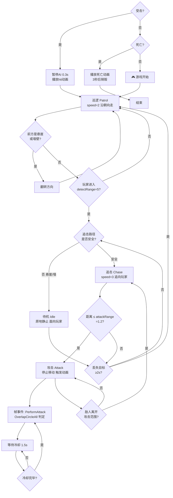
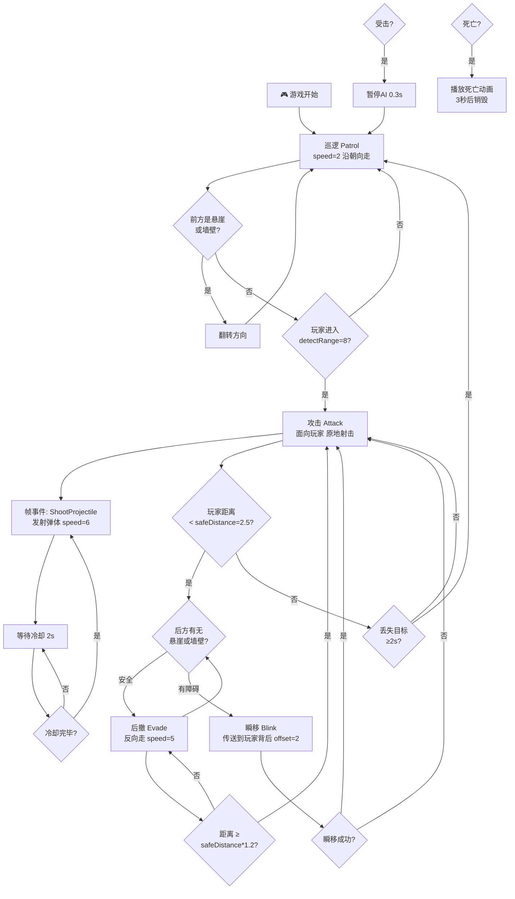
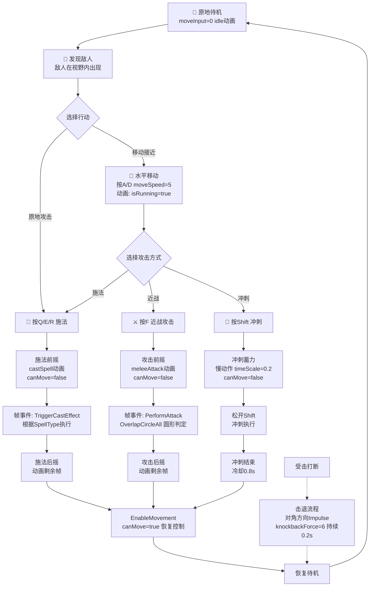
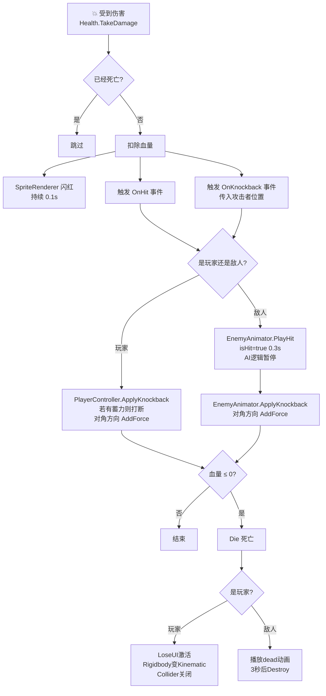
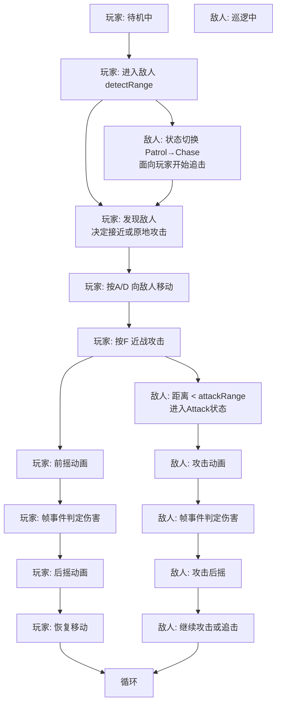

# 行为逻辑流程图

## 一、近战敌人行为逻辑

```mermaid
flowchart TD
    A["🎮 游戏开始"]
    B["巡逻 Patrol<br/>speed=2 沿朝向走"]
    C{"前方是悬崖<br/>或墙壁?"}
    D["翻转方向"]
    E{"玩家进入<br/>detectRange=5?"}
    F{"追击路径<br/>是否安全?"}
    G["待机 Idle<br/>原地静止 面向玩家"]
    H["追击 Chase<br/>speed=3 追向玩家"]
    I{"距离 &le; attackRange<br/>=1.2?"}
    J{"丢失目标<br/>&ge;2s?"}
    K["攻击 Attack<br/>停止移动 触发动画"]
    L["帧事件: PerformAttack<br/>OverlapCircleAll 判定"]
    M["等待冷却 1.5s"]
    N{"冷却完毕?"}
    O{"敌人离开<br/>攻击范围?"}
    P{"受击?"}
    Q["暂停AI 0.3s<br/>播放hit动画"]
    R{"死亡?"}
    S["播放死亡动画<br/>3秒后销毁"]
    T["结束"]

    A --> B
    B --> C
    C -->|是| D
    D --> B
    C -->|否| E
    E -->|否| B
    E -->|是| F
    F -->|否 悬崖/墙| G
    F -->|安全| H
    G --> J
    J -->|是| B
    J -->|否| F
    H --> I
    I -->|是| K
    I -->|否| J
    K --> L
    L --> M
    M --> N
    N -->|是| L
    N -->|否| M
    K --> O
    O -->|是| H
    O -->|否| K
    P -->|是| Q
    Q --> B
    P -->|否| R
    R -->|是| S
    S --> T
    R -->|否| A
```

## 二、远程敌人行为逻辑

```mermaid
flowchart TD
    A["🎮 游戏开始"]
    B["巡逻 Patrol<br/>speed=2 沿朝向走"]
    C{"前方是悬崖<br/>或墙壁?"}
    D["翻转方向"]
    E{"玩家进入<br/>detectRange=8?"}
    F["攻击 Attack<br/>面向玩家 原地射击"]
    G["帧事件: ShootProjectile<br/>发射弹体 speed=6"]
    H["等待冷却 2s"]
    I{"冷却完毕?"}
    J{"玩家距离<br/>&lt; safeDistance=2.5?"}
    K{"丢失目标<br/>&ge;2s?"}
    L{"后方有无<br/>悬崖或墙壁?"}
    M["后撤 Evade<br/>反向走 speed=5"]
    N{"距离 &ge;<br/>safeDistance*1.2?"}
    O["瞬移 Blink<br/>传送到玩家背后 offset=2"]
    P{"瞬移成功?"}
    Q{"受击?"}
    R["暂停AI 0.3s"]
    S{"死亡?"}
    T["播放死亡动画<br/>3秒后销毁"]

    A --> B
    B --> C
    C -->|是| D
    D --> B
    C -->|否| E
    E -->|否| B
    E -->|是| F
    F --> G
    G --> H
    H --> I
    I -->|是| G
    I -->|否| H
    F --> J
    J -->|是| L
    J -->|否| K
    K -->|是| B
    K -->|否| F
    L -->|安全| M
    L -->|有障碍| O
    M --> N
    N -->|是| F
    N -->|否| M
    M --> L
    O --> P
    P -->|是| F
    P -->|否| F
    Q -->|是| R
    R --> B
    S -->|是| T
```

## 三、玩家战斗动作流程（原地待机 → 发现敌人 → 移动 → 攻击 → 后摇）

```mermaid
flowchart TD
    A["🧍 原地待机<br/>moveInput=0 idle动画"]
    B["👀 发现敌人<br/>敌人在视野内出现"]
    C{"选择行动"}
    D["🏃 水平移动<br/>按A/D moveSpeed=5<br/>动画: isRunning=true"]
    E{"选择攻击方式"}
    F["⚔️ 按F 近战攻击"]
    G["🔮 按Q/E/R 施法"]
    H["💨 按Shift 冲刺"]
    I["攻击前摇<br/>meleeAttack动画<br/>canMove=false"]
    J["施法前摇<br/>castSpell动画<br/>canMove=false"]
    K["冲刺蓄力<br/>慢动作 timeScale=0.2<br/>canMove=false"]
    L["帧事件: PerformAttack<br/>OverlapCircleAll 圆形判定"]
    M["帧事件: TriggerCastEffect<br/>根据SpellType执行"]
    N["松开Shift<br/>冲刺执行"]
    O["施法后摇<br/>动画剩余帧"]
    P["攻击后摇<br/>动画剩余帧"]
    Q["冲刺结束<br/>冷却0.8s"]
    R["EnableMovement<br/>canMove=true 恢复控制"]
    S["受击打断"]
    T["击退流程<br/>对角方向Impulse<br/>knockbackForce=6 持续0.2s"]
    U["恢复待机"]

    A --> B
    B --> C
    C -->|移动接近| D
    C -->|原地攻击| G
    D --> E
    E -->|近战| F
    E -->|施法| G
    E -->|冲刺| H
    F --> I
    G --> J
    H --> K
    I --> L
    J --> M
    K --> N
    L --> P
    M --> O
    N --> Q
    O --> R
    P --> R
    Q --> R
    R --> U
    U --> A
    S -.-> T
    T -.-> U
```

## 四、受击流程

```mermaid
flowchart TD
    A["💥 受到伤害<br/>Health.TakeDamage"]
    B{"已经死亡?"}
    C["跳过"]
    D["扣除血量"]
    E["SpriteRenderer 闪红<br/>持续 0.1s"]
    F["触发 OnHit 事件"]
    G["触发 OnKnockback 事件<br/>传入攻击者位置"]
    H{"是玩家还是敌人?"}
    I["EnemyAnimator.PlayHit<br/>isHit=true 0.3s<br/>AI逻辑暂停"]
    J["PlayerController.ApplyKnockback<br/>若有蓄力则打断<br/>对角方向 AddForce"]
    K["EnemyAnimator.ApplyKnockback<br/>对角方向 AddForce"]
    L{"血量 &le; 0?"}
    M["结束"]
    N["Die 死亡"]
    O{"是玩家?"}
    P["LoseUI激活<br/>Rigidbody变Kinematic<br/>Collider关闭"]
    Q["播放dead动画<br/>3秒后Destroy"]

    A --> B
    B -->|是| C
    B -->|否| D
    D --> E
    D --> F
    D --> G
    F --> H
    G --> H
    H -->|玩家| J
    H -->|敌人| I
    I --> K
    J --> L
    K --> L
    L -->|否| M
    L -->|是| N
    N --> O
    O -->|玩家| P
    O -->|敌人| Q
```

## 五、发现敌人 → 攻击 时序

```mermaid
flowchart TD
    P1["玩家: 待机中"]
    E1["敌人: 巡逻中"]
    P2["玩家: 进入敌人 detectRange"]
    E2["敌人: 状态切换 Patrol→Chase<br/>面向玩家开始追击"]
    P3["玩家: 发现敌人<br/>决定接近或原地攻击"]
    P4["玩家: 按A/D 向敌人移动"]
    P5["玩家: 按F 近战攻击"]
    E3["敌人: 距离 < attackRange<br/>进入Attack状态"]
    P6["玩家: 前摇动画"]
    E4["敌人: 攻击动画"]
    P7["玩家: 帧事件判定伤害"]
    E5["敌人: 帧事件判定伤害"]
    P8["玩家: 后摇动画"]
    E6["敌人: 攻击后摇"]
    P9["玩家: 恢复移动"]
    E7["敌人: 继续攻击或追击"]
    P10["循环"]

    P1 --> P2
    P2 --> E2
    P2 --> P3
    E2 --> P3
    P3 --> P4
    P4 --> P5
    P5 --> P6
    P5 --> E3
    E3 --> E4
    P6 --> P7
    E4 --> E5
    P7 --> P8
    E5 --> E6
    P8 --> P9
    E6 --> E7
    P9 --> P10
    E7 --> P10
```
