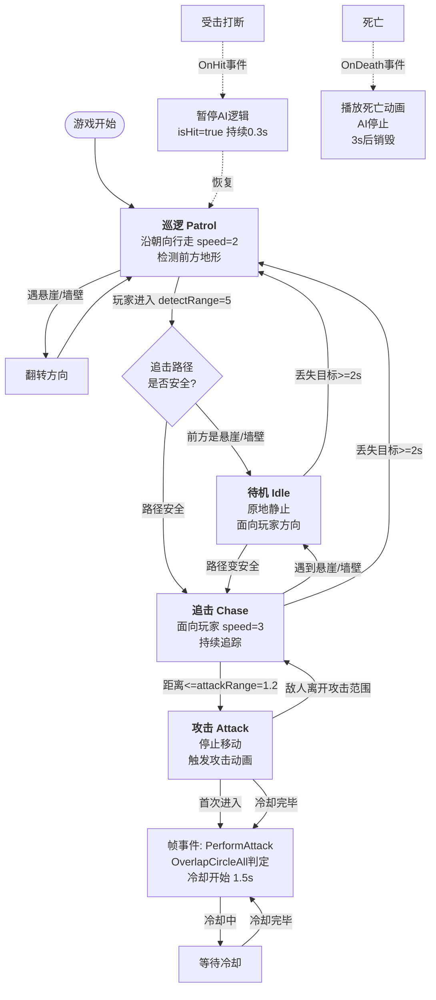
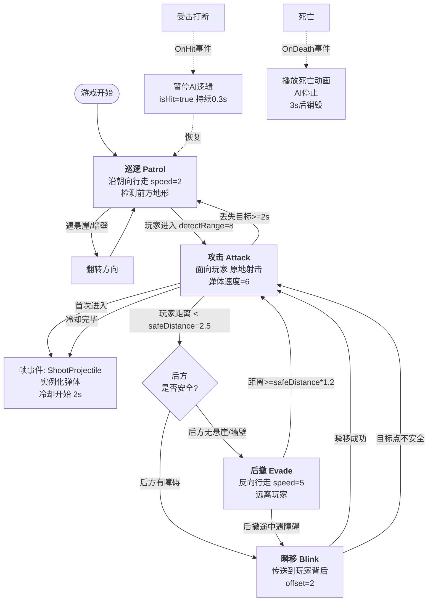
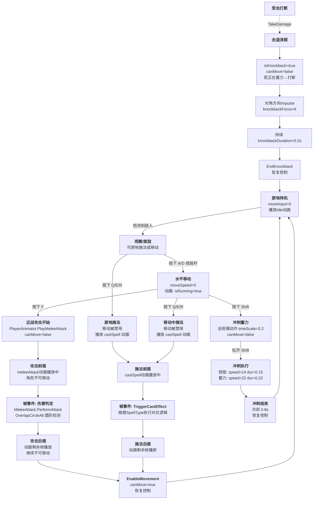
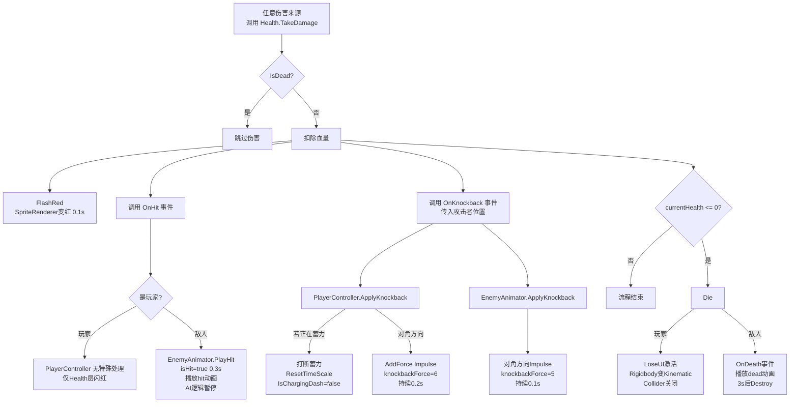
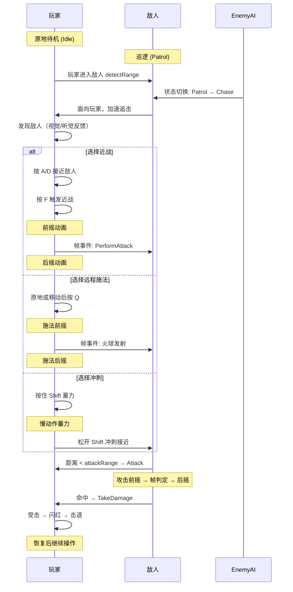

# 行为逻辑流程图

## 一、近战敌人行为逻辑（EnemyAI）

```mermaid
flowchart TD
    Start([游戏开始]) --> Patrol

    Patrol[<b>巡逻 Patrol</b><br/>沿朝向行走 speed=2<br/>检测前方地形]
    Patrol -->|遇悬崖/墙壁| Flip[翻转方向]
    Flip --> Patrol
    Patrol -->|玩家进入 detectRange=5| CheckChase{追击路径<br/>是否安全?}

    CheckChase -->|前方是悬崖/墙壁| Idle
    CheckChase -->|路径安全| Chase

    Idle[<b>待机 Idle</b><br/>原地静止<br/>面向玩家方向]
    Idle -->|丢失目标>=2s| Patrol
    Idle -->|路径变安全| Chase

    Chase[<b>追击 Chase</b><br/>面向玩家 speed=3<br/>持续追踪]
    Chase -->|距离<=attackRange=1.2| Attack
    Chase -->|遇到悬崖/墙壁| Idle
    Chase -->|丢失目标>=2s| Patrol

    Attack[<b>攻击 Attack</b><br/>停止移动<br/>触发攻击动画]
    Attack -->|首次进入| AttackExec[帧事件: PerformAttack<br/>OverlapCircleAll判定<br/>冷却开始 1.5s]
    Attack -->|冷却完毕| AttackExec
    AttackExec -->|冷却中| WaitCooldown[等待冷却]
    WaitCooldown -->|冷却完毕| AttackExec
    Attack -->|敌人离开攻击范围| Chase

    Hit[受击打断] -.->|OnHit事件| PauseAI[暂停AI逻辑<br/>isHit=true 持续0.3s]
    PauseAI -.->|恢复| Patrol

    Death[死亡] -.->|OnDeath事件| DeadState[播放死亡动画<br/>AI停止<br/>3s后销毁]
```

## 二、远程敌人行为逻辑（RangedEnemyAI）

```mermaid
flowchart TD
    Start([游戏开始]) --> Patrol

    Patrol[<b>巡逻 Patrol</b><br/>沿朝向行走 speed=2<br/>检测前方地形]
    Patrol -->|遇悬崖/墙壁| Flip[翻转方向]
    Flip --> Patrol
    Patrol -->|玩家进入 detectRange=8| Attack

    Attack[<b>攻击 Attack</b><br/>面向玩家 原地射击<br/>弹体速度=6]
    Attack -->|首次进入| Shoot[帧事件: ShootProjectile<br/>实例化弹体<br/>冷却开始 2s]
    Attack -->|冷却完毕| Shoot
    Attack -->|丢失目标>=2s| Patrol
    Attack -->|玩家距离 < safeDistance=2.5| EvadeChoice{后方<br/>是否安全?}

    EvadeChoice -->|后方无悬崖/墙壁| Evade
    EvadeChoice -->|后方有障碍| Blink

    Evade[<b>后撤 Evade</b><br/>反向行走 speed=5<br/>远离玩家]
    Evade -->|距离>=safeDistance*1.2| Attack
    Evade -->|后撤途中遇障碍| Blink

    Blink[<b>瞬移 Blink</b><br/>传送到玩家背后<br/>offset=2]
    Blink -->|瞬移成功| Attack
    Blink -->|目标点不安全| Attack

    Hit[受击打断] -.->|OnHit事件| PauseAI[暂停AI逻辑<br/>isHit=true 持续0.3s]
    PauseAI -.->|恢复| Patrol

    Death[死亡] -.->|OnDeath事件| DeadState[播放死亡动画<br/>AI停止<br/>3s后销毁]
```

## 三、玩家受击→战斗完整动作流程

```mermaid
flowchart TD
    Idle[<b>原地待机</b><br/>moveInput=0<br/>播放idle动画]

    Idle -->|检测到敌人| Observe[<b>观察/索敌</b><br/>可原地施法或移动]

    Observe -->|按下 A/D 或摇杆| Moving[<b>水平移动</b><br/>moveSpeed=5<br/>动画: isRunning=true]

    Observe -->|按下 Q/E/R| CastFromIdle[<b>原地施法</b><br/>移动被禁用<br/>播放 castSpell 动画]

    Moving -->|按下 F| MeleeStart[<b>近战攻击开始</b><br/>PlayerAnimator.PlayMeleeAttack<br/>canMove=false]

    Moving -->|按下 Q/E/R| CastFromMove[<b>移动中施法</b><br/>移动被禁用<br/>播放 castSpell 动画]

    Moving -->|按下 Shift| DashCharge[<b>冲刺蓄力</b><br/>全局慢动作 timeScale=0.2<br/>canMove=false]

    MeleeStart --> MeleeAntic[<b>攻击前摇</b><br/>meleeAttack动画播放中<br/>角色不可移动]

    MeleeAntic --> MeleeHit[<b>帧事件: 伤害判定</b><br/>MeleeAttack.PerformAttack<br/>OverlapCircleAll 圆形检测]

    MeleeHit --> MeleeRecovery[<b>攻击后摇</b><br/>动画剩余帧播放<br/>继续不可移动]

    MeleeRecovery --> EnableMove[<b>EnableMovement</b><br/>canMove=true<br/>恢复控制]

    EnableMove --> Idle

    CastFromIdle --> CastAntic[<b>施法前摇</b><br/>castSpell动画播放中]

    CastFromMove --> CastAntic

    CastAntic --> CastFrame[<b>帧事件: TriggerCastEffect</b><br/>根据SpellType执行对应逻辑]

    CastFrame --> CastRecovery[<b>施法后摇</b><br/>动画剩余帧播放]

    CastRecovery --> EnableMove

    DashCharge -->|松开 Shift| DashExec[<b>冲刺执行</b><br/>短按: speed=14 dur=0.15<br/>蓄力: speed=22 dur=0.22]
    DashExec --> DashEnd[<b>冲刺结束</b><br/>冷却 0.8s<br/>恢复控制]
    DashEnd --> Idle

    Hit[<b>受击打断</b>] -.->|TakeDamage| KnockbackFlow[<b>击退流程</b>]
    KnockbackFlow --> KBStart[isKnockback=true<br/>canMove=false<br/>若正在蓄力→打断]
    KBStart --> KBForce[对角方向Impulse<br/>knockbackForce=6]
    KBForce --> KBWait[持续 knockbackDuration=0.2s]
    KBWait --> KBEnd[EndKnockback<br/>恢复控制]
    KBEnd --> Idle
```

## 四、受击事件链

```mermaid
flowchart TD
    DMG[任意伤害来源<br/>调用 Health.TakeDamage] --> CheckDead{IsDead?}
    CheckDead -->|是| SkipDMG[跳过伤害]

    CheckDead -->|否| SubHP[扣除血量]
    SubHP --> Flash[FlashRed<br/>SpriteRenderer变红 0.1s]
    SubHP --> InvokeHit[调用 OnHit 事件]
    SubHP --> InvokeKB[调用 OnKnockback 事件<br/>传入攻击者位置]

    InvokeHit --> PlayerHit{是玩家?}
    PlayerHit -->|玩家| PlayerHitAnim[PlayerController 无特殊处理<br/>仅Health层闪红]
    PlayerHit -->|敌人| EnemyHitAnim[EnemyAnimator.PlayHit<br/>isHit=true 0.3s<br/>播放hit动画<br/>AI逻辑暂停]

    InvokeKB --> PlayerKB[PlayerController.ApplyKnockback]
    PlayerKB -->|若正在蓄力| CancelCharge[打断蓄力<br/>ResetTimeScale<br/>IsChargingDash=false]
    PlayerKB -->|对角方向| PlayerImpulse[AddForce Impulse<br/>knockbackForce=6<br/>持续0.2s]

    InvokeKB --> EnemyKB[EnemyAnimator.ApplyKnockback]
    EnemyKB --> EnemyImpulse[对角方向Impulse<br/>knockbackForce=5<br/>持续0.1s]

    SubHP --> CheckZero{currentHealth <= 0?}
    CheckZero -->|否| Done[流程结束]
    CheckZero -->|是| Die[Die]
    Die -->|玩家| PlayerDie[LoseUI激活<br/>Rigidbody变Kinematic<br/>Collider关闭]
    Die -->|敌人| EnemyDie[OnDeath事件<br/>播放dead动画<br/>3s后Destroy]
```

## 五、发现敌人→攻击时序图

```mermaid
sequenceDiagram
    participant P as 玩家
    participant E as 敌人
    participant AI as EnemyAI

    Note over P: 原地待机 (Idle)
    Note over E: 巡逻 (Patrol)

    P->>E: 玩家进入敌人 detectRange
    AI->>E: 状态切换: Patrol → Chase
    E->>P: 面向玩家，加速追击

    P->>P: 发现敌人（视觉/听觉反馈）

    alt 选择近战
        P->>P: 按 A/D 接近敌人
        P->>P: 按 F 触发近战
        Note over P: 前摇动画
        P->>E: 帧事件: PerformAttack
        Note over P: 后摇动画
    else 选择远程施法
        P->>P: 原地或移动后按 Q
        Note over P: 施法前摇
        P->>E: 帧事件: 火球发射
        Note over P: 施法后摇
    else 选择冲刺
        P->>P: 按住 Shift 蓄力
        Note over P: 慢动作蓄力
        P->>E: 松开 Shift 冲刺接近
    end

    E->>P: 距离 < attackRange → Attack
    Note over E: 攻击前摇 → 帧判定 → 后摇
    E->>P: 命中 → TakeDamage

    P->>P: 受击 → 闪红 → 击退
    Note over P: 恢复后继续操作
```
