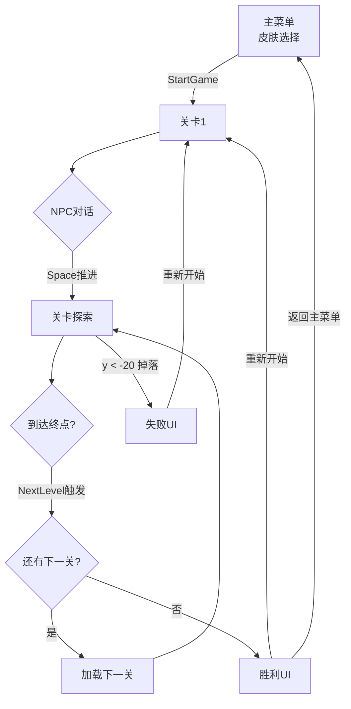
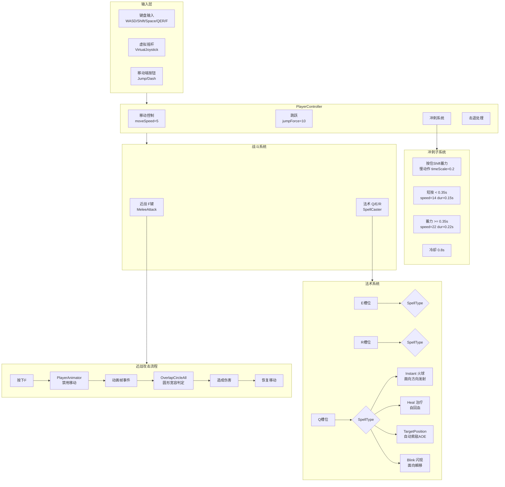
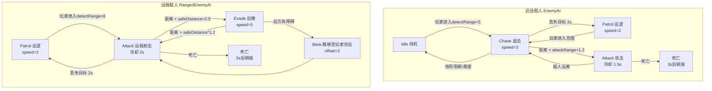
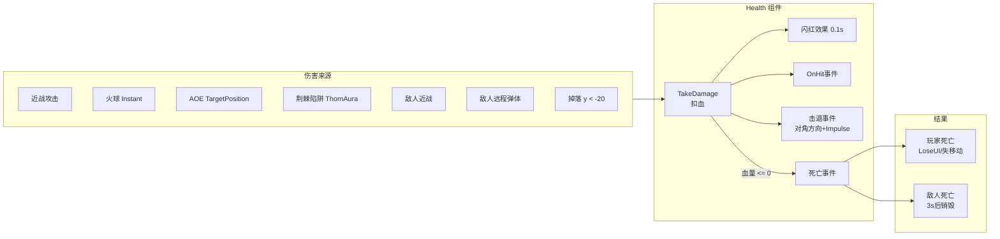
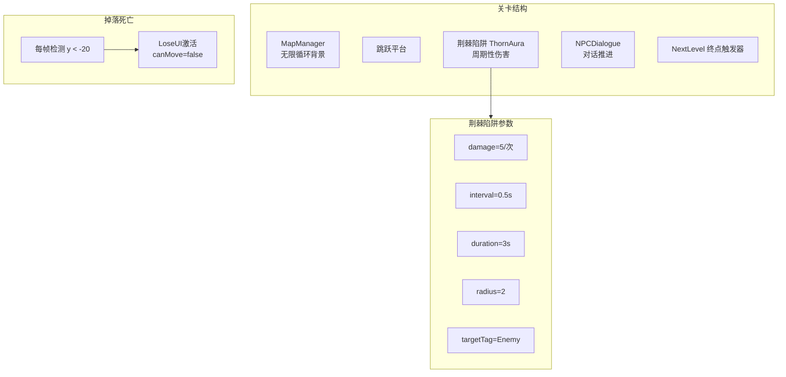
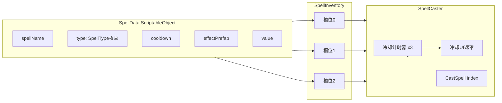
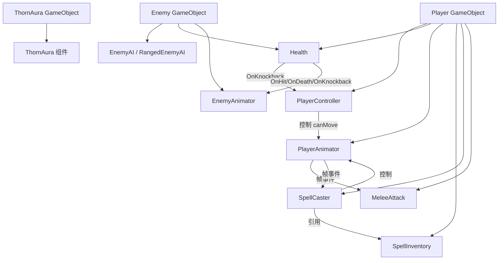

# 横板像素法师 - 项目架构流程图

## 一、游戏整体流程

```mermaid
flowchart TD
    A[主菜单<br/>皮肤选择] -->|StartGame| B[关卡1]
    B --> C{NPC对话}
    C -->|Space推进| D[关卡探索]
    D --> E{到达终点?}
    E -->|NextLevel触发| F{还有下一关?}
    F -->|是| G[加载下一关]
    G --> D
    F -->|否| H[胜利UI]
    D -->|y < -20 掉落| I[失败UI]
    I -->|重新开始| B
    H -->|重新开始| B
    H -->|返回主菜单| A
```

## 二、玩家系统架构

```mermaid
flowchart TD
    subgraph Input[输入层]
        KB[键盘输入<br/>WASD/Shift/Space/QER/F]
        JS[虚拟摇杆<br/>VirtualJoystick]
        MB[移动端按钮<br/>Jump/Dash]
    end

    subgraph Controller[PlayerController]
        Move[移动控制<br/>moveSpeed=5]
        Jump[跳跃<br/>jumpForce=10]
        Dash[冲刺系统]
        Knockback[击退处理]
    end

    subgraph DashDetail[冲刺子系统]
        Charge[按住Shift蓄力<br/>慢动作 timeScale=0.2]
        Short[短按 < 0.35s<br/>speed=14 dur=0.15s]
        Long[蓄力 >= 0.35s<br/>speed=22 dur=0.22s]
        Cooldown[冷却 0.8s]
    end

    subgraph Combat[战斗系统]
        Melee[近战 F键<br/>MeleeAttack]
        Spell[法术 Q/E/R<br/>SpellCaster]
    end

    subgraph MeleeDetail[近战攻击流程]
        PressF[按下F] --> Anim[PlayerAnimator<br/>禁用移动]
        Anim --> Frame[动画帧事件] --> Circle[OverlapCircleAll<br/>圆形宽容判定]
        Circle --> DMG[造成伤害] --> Restore[恢复移动]
    end

    subgraph SpellDetail[法术系统]
        Q[Q槽位] --> Type1{SpellType}
        E[E槽位] --> Type2{SpellType}
        R[R槽位] --> Type3{SpellType}
        Type1 --> Instant[Instant 火球<br/>面向方向发射]
        Type1 --> Heal[Heal 治疗<br/>自回血]
        Type1 --> TargetPos[TargetPosition<br/>自动索敌AOE]
        Type1 --> Blink[Blink 闪现<br/>面向瞬移]
    end

    Input --> Controller
    Controller --> Combat
    Dash --> DashDetail
    Melee --> MeleeDetail
    Spell --> SpellDetail
```

## 三、敌人AI状态机

```mermaid
flowchart TD
    subgraph MeleeEnemy[近战敌人 EnemyAI]
        M_Idle[Idle 待机] -->|玩家进入detectRange=5| M_Chase
        M_Patrol[Patrol 巡逻<br/>speed=2] -->|玩家进入范围| M_Chase
        M_Chase[Chase 追击<br/>speed=3] -->|距离 < attackRange=1.2| M_Attack
        M_Chase -->|地形阻断/悬崖| M_Idle
        M_Chase -->|丢失目标 2s| M_Patrol
        M_Attack[Attack 攻击<br/>冷却 1.5s] -->|敌人远离| M_Chase
        M_Attack -->|死亡| M_Dead[死亡<br/>3s后销毁]
    end

    subgraph RangedEnemy[远程敌人 RangedEnemyAI]
        R_Patrol[Patrol 巡逻<br/>speed=2] -->|玩家进入detectRange=8| R_Attack
        R_Attack[Attack 远程射击<br/>冷却 2s] -->|丢失目标 2s| R_Patrol
        R_Attack -->|距离 < safeDistance=2.5| R_Evade
        R_Evade[Evade 后撤<br/>speed=5] -->|后方有障碍| R_Blink
        R_Evade -->|距离 > safeDistance*1.2| R_Attack
        R_Blink[Blink 瞬移至玩家背后<br/>offset=2] --> R_Attack
        R_Attack -->|死亡| R_Dead[死亡<br/>3s后销毁]
    end
```

## 四、伤害与生命系统

```mermaid
flowchart LR
    subgraph DamageSource[伤害来源]
        S1[近战攻击]
        S2[火球 Instant]
        S3[AOE TargetPosition]
        S4[荆棘陷阱 ThornAura]
        S5[敌人近战]
        S6[敌人远程弹体]
        S7[掉落 y < -20]
    end

    subgraph HealthSystem[Health 组件]
        TakeDMG[TakeDamage<br/>扣血]
        Flash[闪红效果 0.1s]
        OnHit[OnHit事件]
        OnKnockback[击退事件<br/>对角方向+Impulse]
        OnDeath[死亡事件]
    end

    subgraph Result[结果]
        PlayerDead[玩家死亡<br/>LoseUI/失移动]
        EnemyDead[敌人死亡<br/>3s后销毁]
    end

    DamageSource --> TakeDMG
    TakeDMG --> Flash
    TakeDMG --> OnHit
    TakeDMG --> OnKnockback
    TakeDMG -->|血量 <= 0| OnDeath
    OnDeath --> PlayerDead
    OnDeath --> EnemyDead
```

## 五、关卡与场景系统

```mermaid
flowchart TD
    subgraph Level[关卡结构]
        Map[MapManager<br/>无限循环背景]
        Platforms[跳跃平台]
        Spikes[荆棘陷阱 ThornAura<br/>周期性伤害]
        NPC[NPCDialogue<br/>对话推进]
        Goal[NextLevel 终点触发器]
    end

    subgraph ThornDetail[荆棘陷阱参数]
        T1[damage=5/次]
        T2[interval=0.5s]
        T3[duration=3s]
        T4[radius=2]
        T5[targetTag=Enemy]
    end

    subgraph FallDeath[掉落死亡]
        Check[每帧检测 y < -20]
        Check --> Lose[LoseUI激活<br/>canMove=false]
    end

    Spikes --> ThornDetail
```

## 六、数据流与ScriptableObject

```mermaid
flowchart LR
    subgraph Data[SpellData ScriptableObject]
        D1[spellName]
        D2[type: SpellType枚举]
        D3[cooldown]
        D4[effectPrefab]
        D5[value]
    end

    subgraph Inventory[SpellInventory]
        Slot0[槽位0]
        Slot1[槽位1]
        Slot2[槽位2]
    end

    subgraph Caster[SpellCaster]
        Cooldown[冷却计时器 x3]
        UI[冷却UI遮罩]
        Cast[CastSpell index]
    end

    Data --> Slot0
    Data --> Slot1
    Data --> Slot2
    Slot0 --> Caster
    Slot1 --> Caster
    Slot2 --> Caster
    Caster --> Cooldown
    Cooldown --> UI
```

## 七、组件依赖关系

```mermaid
flowchart TD
    Player[Player GameObject] --> PC[PlayerController]
    Player --> Health[Health]
    Player --> PA[PlayerAnimator]
    Player --> SI[SpellInventory]
    Player --> SC[SpellCaster]
    Player --> MA[MeleeAttack]

    Enemy[Enemy GameObject] --> EAI[EnemyAI / RangedEnemyAI]
    Enemy --> Health
    Enemy --> EA[EnemyAnimator]

    Thorn[ThornAura GameObject] --> TA[ThornAura 组件]

    Health -->|OnKnockback| PC
    Health -->|OnHit/OnDeath/OnKnockback| EA
    PC -->|控制 canMove| PA
    SC -->|引用| SI
    SC -->|控制| PA
    PA -->|帧事件| MA
    PA -->|帧事件| SC
```
